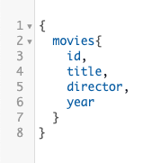

# Petunjuk

1. Jalankan 2 terminal dimana terminal pertama menjalankan command **npm run dev** dan terminal kedua menjalankan command **npm run json**
2. Buka browser dan ketik localhost:4000/graphql (port 4000 ini dapat diubah di dalam codingan)
3. Masukkan query yang dibutuhkan di bagian sebelah kiri halaman utama graphql

### Contoh Query

**Nama Kelompok :**
* 1872006 Michael Widjajahalim
* 1872011 Stephen Candra
* 1872020 Kelvin William
* 1872034 Billy Arya Anugrah
* 1872035 Rivaldo Stuart Wattimena
